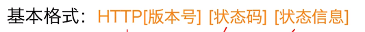
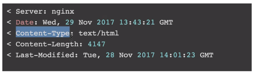

### http请求行: 
* GET / HTTP/1.1

### 请求头部:
* Host: php.net
* User-Agent: Mozilla/5.0 (Windows NT 6.1; Win64; x64) AppleWebKit/537.36 (KHTML, like Gecko) Chrome/68.0.3440.106 Safari/537.36
* Accept: text/html

### 响应行


### 响应头部


#### laravel
使用request()->header();可以显示请求头部
上传文件,修改表单的enctype属性, 就修改了请求同步的content-type的值

### 同源策略和跨域共享
#### 1.使用 jsonp
客户端:
``` 
function callbackFunction(param){...}

<script type="text/javascript" src="http://www.runoob.com/try/ajax/jsonp.php?jsoncallback=callbackFunction"></script>
```

服务端:
``` 
<?php
header('Content-type: application/json');
//获取回调函数名
$jsoncallback = htmlspecialchars($_REQUEST ['jsoncallback']);
//json数据
$json_data = '["customername1","customername2"]';
//输出jsonp格式的数据
echo $jsoncallback . "(" . $json_data . ")";
?>
```

答案就藏在服务端的代码中，当服务端支持JSONP技术时，会做如下一些设置：

* 识别请求的URL，提取callback参数的值，并动态生成一个执行该参数值（一个函数）的JavaScript语句；
* 将需要返回的数据放入动态生成的函数中，等待其加在到页面时被执行；

> 最后，我们还要对JSONP技术再强调两点：
>JSONP技术与AJAX技术无关：虽然同样牵扯到跨域获取资源这个主题，但我们应该已经清楚的看到，JSONP的本质是绕过AJAX获取资源的机制，使用原始的src属性获取异域资源；
>JSONP技术存在一下三点缺陷：
>* 无法发送POST请求，也就是说JSONP技术只
简单ajax请求能用于请求异域资源，无法上传数据或修改异域数据；
>* 无法监测JSONP请求是否失败；
>* 可能存在安全隐患：别忘了，JSONP之所以能成功获取异域服务器资源，靠的是服务器动态生成了回调函数，并在页面中执行，那么如果服务器在原有的回调函数下再添加些别的恶意JavaScript代码会怎样？当然也会被执行！所以在使用JSONP技术时，一定要确保请求资源的服务器是值得信赖的；

#### 2.使用CORS
简单ajax请求:

当浏览器检测到一个简单的跨域AJAX请求，浏览器会首先为我们添加一个头部信息：Origin它的值为请求发送代码所在的源（希望你还记得，一个源由“协议”，“域名和端口”组成）。类似这样：
``` 
GET /cors HTTP/1.1
Origin: http://api.bob.com
Host: api.alice.com
Accept-Language: en-US
Connection: keep-alive
User-Agent: Mozilla/5.0 ...
```

而当这样的一条HTTP请求发送到服务端时，服务端会检测该请求报头中的Origin字段的值是否在许可范围内，如果的确是服务端认可的域，那么服务端会在响应报文中添加如下字段：

* Access-Control-Allow-Origin（必须）：该字段用来告知浏览器服务端接受的能够发送跨域AJAX请求的域，它的值要么是该次AJAX请求报头中由浏览器自动添加的Origin值，要么还可以是一个\*号，表示可以接受任意的域名请求；
* Access-Control-Allow-Credentials（可选）：该字段用来告知浏览器是否允许客户端向服务端发送Cookie。默认情况下，CORS规范会阻止跨域AJAX向服务端发送Cookie，因此该字段默认值为false，当你显式的将该字段值设置为true时，则表示允许此次跨域AJAX向服务端发送Cookie。
* Access-Control-Expose-Headers（可选）：该字段用来向客户端暴露可获取的响应头；

复杂ajax请求:

> 复杂“的AJAX跨域请求一共会发送两次HTTP请求，其中第一次为”查询请求“，第二次才是我们正式的”AJAX跨域请求“。为什么多出了一次”查询请求“呢？道理其实很简单，我们想象一下当发送”复杂“的AJAX跨域请求时，浏览器最先拿到请求开始识别，然后发现这个请求并不“单纯”（不满足简单跨域AJAX请求标准），于是感到十分疑惑的浏览器会试探的沿着请求的地址向服务端发问，询问服务端是否允许异域的客户端向它发送额外的请求信息，这一次“发问”，即是第一次HTTP请求，即“查询请求”。而服务端当然也会这次“发问”给出相应的回答，然后浏览器就会根据回答的结果决定是否继续发送该跨域AJAX请求。

[参考:https://segmentfault.com/a/1190000012302319](https://segmentfault.com/a/1190000012302319)

> 三次握手：
> * 第一次握手：客户端发送syn包(syn=x)到服务器，并进入SYN_SEND状态，等待服务器确认；
> * 第二次握手：服务器收到syn包，必须确认客户的SYN（ack=x+1），同时自己也发送一个SYN包（syn=y），即SYN+ACK包，此时服务器进入SYN_RECV状态；
> * 第三次握手：客户端收到服务器的SYN＋ACK包，向服务器发送确认包ACK(ack=y+1)，此包发送完毕，客户端和服务器进入ESTABLISHED状态，完成三次握手。
握手过程中传送的包里不包含数据，三次握手完毕后，客户端与服务器才正式开始传送数据。理想状态下，TCP连接一旦建立，在通信双方中的任何一方主动关闭连接之前，TCP 连接都将被一直保持下去。

>四次握手
与建立连接的“三次握手”类似，断开一个TCP连接则需要“四次握手”。
> * 第一次挥手：主动关闭方发送一个FIN，用来关闭主动方到被动关闭方的数据传送，也就是主动关闭方告诉被动关闭方：我已经不会再给你发数据了(当然，在fin包之前发送出去的数据，如果没有收到对应的ack确认报文，主动关闭方依然会重发这些数据)，但是，此时主动关闭方还可以接受数据。
> * 第二次挥手：被动关闭方收到FIN包后，发送一个ACK给对方，确认序号为收到序号+1（与SYN相同，一个FIN占用一个序号）。
> * 第三次挥手：被动关闭方发送一个FIN，用来关闭被动关闭方到主动关闭方的数据传送，也就是告诉主动关闭方，我的数据也发送完了，不会再给你发数据了。
> * 第四次挥手：主动关闭方收到FIN后，发送一个ACK给被动关闭方，确认序号为收到序号+1，至此，完成四次挥手。

### JSON Web Token(JWT)
* 应用和数据库核对用户名和密码
* 核对用户名和密码成功后，应用将用户的id作为JWT Payload的一个属性，将其与头部分别进行Base64编码拼接后签名，形成一个JWT。(这里的头部为JWT的头部)
* 将JWT字符串作为该请求Cookie的一部分返回给用户。注意，在这里必须使用HttpOnly属性来防止Cookie被JavaScript读取
* 在Cookie失效或者被删除前，用户每次访问应用，应用都会接受到含有jwt的Cookie。从而应用就可以将JWT从请求中提取出来
* 当从客户端带过来token参数的时候，直接对头部和Payload再次调用加密算法，看生成的新的签名和之前的签名是否一致，判断数据是否被篡改。

### 单点登录
Session方式来存储用户id，一开始用户的Session只会存储在一台服务器上。对于有多个子域名的站点，每个子域名至少会对应一台不同的服务器，例如：
* www.taobao.com
* nv.taobao.com
* nz.taobao.com
* login.taobao.com

所以如果要实现在login.taobao.com登录后，在其他的子域名下依然可以取到Session，这要求我们在多台服务器上同步Session。

使用JWT的方式则没有这个问题的存在，因为用户的状态已经被传送到了客户端。因此，我们只需要将含有JWT的Cookie的domain设置为顶级域名即可，例如
``` 
Set-Cookie: jwt=lll.zzz.xxx; HttpOnly; max-age=980000; domain=.taobao.com
```
注意domain必须设置为一个点加顶级域名，即.taobao.com。这样，taobao.com和*.taobao.com就都可以接受到这个Cookie，并获取JWT了。

[摘自](http://blog.leapoahead.com/2015/09/07/user-authentication-with-jwt/)

### CSRF攻击
#### 攻击流程
1.浏览正常的网站,信息存放在cookie中 用户验证登陆  
2.点击了不正常网站链接跳转不正常网站,不正常网站中有一个链接是提交数据给之前用户验证登陆的网站的  
3.用户点击不正常网站中的链接, 跳转到正常网站,期间携带了正常网站的验证信息与不正常网站的数据,正常网站识别不出  
  
#### 攻击防范 token&referer
> referer 验证  
> 根据HTTP协议,在http请求头中包含一个referer的字段,这个字段记录了该http请求的原地址.通常情况下,执行转账操作的post请求www.bank.com/transfer.php应该是点击www.bank.com网页的按钮来触发的操作,这个时候转账请求的referer应该是www.bank.com.而如果黑客要进行csrf攻击,只能在自己的网站www.hacker.com上伪造请求.伪造请求的referer是www.hacker.com.所以我们通过对比post请求的referer是不是www.bank.com就可以判断请求是否合法.  
>
> 这种方式验证比较简单,网站开发者只要在post请求之前检查referer就可以,但是由于referer是由浏览器提供的.虽然http协议有要求不能篡改referer的值.但是一个网站的安全性绝对不能交由其他人员来保证.  

>token 验证  
>从上面的样式可以发现,攻击者伪造了转账的表单,那么网站可以在表单中加入了一个随机的token来验证.token随着其他请求数据一起被提交到服务器.服务器通过验证token的值来判断post请求是否合法.由于攻击者没有办法获取到页面信息,所以它没有办法知道token的值.那么伪造的表单中就没有该token值.服务器就可以判断出这个请求是伪造的.
#### CSRF和XSS区别
>* CSRF是利用你本身的漏洞，自动执行你本身的接口，依赖于用户需要登录你的网站。
>* XSS不需要做任何登录认证，核心原理是向你的页面注入脚本js，js里包含他想执行的操作（通过合法的评论区注入不可执行的JS)  
可以先进行xss攻击嵌入html样式,在进行csrf攻击携带危险信息 连环攻击一气呵成


