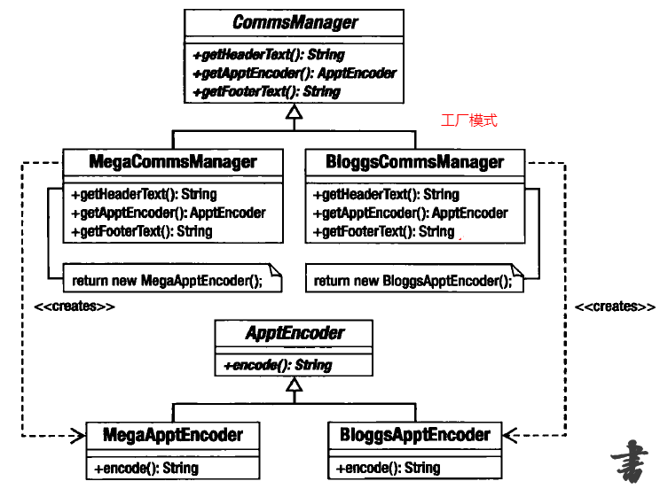
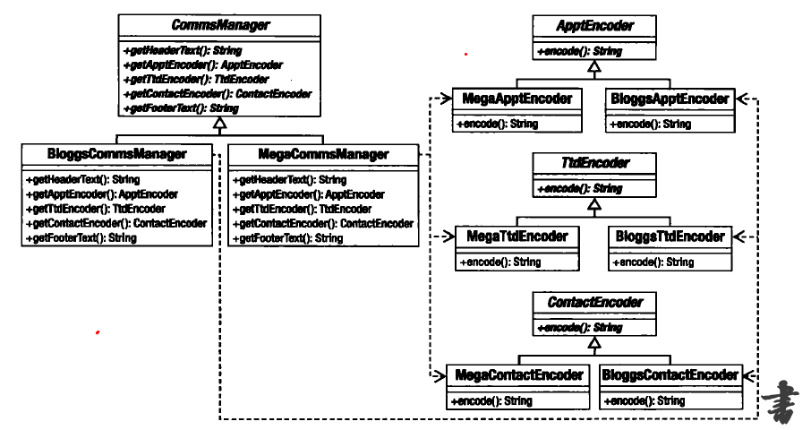

## 1.工厂模式与抽象工厂

工厂模式

抽象工厂

之间的区别, 我的理解是:工厂模式的manager只能拥有对应的Encoder,而抽象工厂的manager能对应多个继承不同抽象类的Encoder

> 1：工厂方法模式 
	一个抽象产品类，可以产生出多个具体产品类。 
	一个抽象工厂类，可以产生出多个具体工厂类。 
	每个具体工厂类只能创建一个具体产品类的实例。
> 2：抽象工厂模式 
	多个抽象产品类，每个抽象产品类可以产生出多个具体产品类。 
	一个抽象工厂类，可以产生出多个具体工厂类。 
	每个具体工厂类可以创建多个具体产品类的实例。
   
## 2.原型模式
就是将不同产品类以依赖组合的形式在工厂类中创建

原型的复制

代码演示

   

